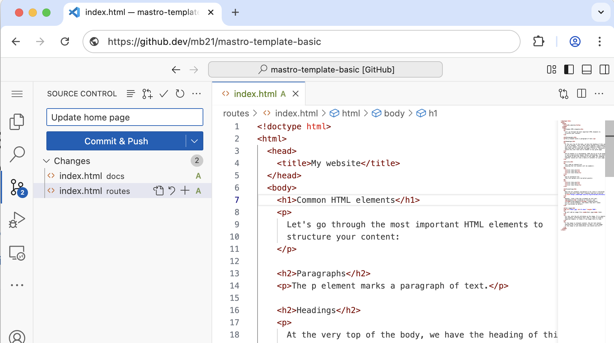

To publish your website to the internet, we need to:

1. Enable _GitHub Pages_ on your GitHub repository (this only needs to be done once)
2. Generate the static site (this creates a new `docs/` folder with all the public files)
3. Save changes to GitHub

## One-time setup

Configure [GitHub Pages](https://docs.github.com/en/pages/getting-started-with-github-pages/configuring-a-publishing-source-for-your-github-pages-site#publishing-from-a-branch) to make the `docs/` folder of your repository accessible as a website:

1. On GitHub, navigate to the **page of the repository** you created in the previous chapter: `https://github.com/your-user-name/your-repository-name/`
2. Click the **Settings** tab on the top right (possibly hiding in a `...` menu).
3. In the **Code and automation** section of the sidebar, click **Pages**.
4. Under **Source**, make sure that **Deploy from a branch** is selected.
5. Under **Branch**,
    - switch the branch from `None` to `main`,
    - switch the folder from `/ (root)` to `/docs`, and
    - click **Save**.

## Generate the static site

In the Mastro preview pane on the right (which previews your website), click the **Generate** button in the top-right corner.

After a slight delay, the _Output_ panel should fade in from the bottom and inform you that mastro built the entire static website (or if anything went wrong). Feel free to close that panel again – it will reappear every time you click the _Generate_ button.

The HTML files are generated in the `docs/` folder, which you should now see in the _Explorer_ view on the left, just above your `routes/` folder. You can look at the generated files in the `docs/` folder, but don't edit them, as they'll be overwriteen the next time you click _Generate_.

We're using the `docs/` folder, because that's the only folder name GitHub Pages allows. (If you know GitHub Pages, you may be wondering why we're not automatically pushing to the `gh-pages` branch. That's because at the moment, it's [not possible](https://github.com/microsoft/vscode-remote-repositories-github/issues/101) for a _VS Code for the Web_ extension to directly interact with git.)

## Save changes and publish to the web

So far, we haven't saved any of the changes we made back to GitHub. To do that, switch to the _Source Control_ view in the activity bar on the left.

The first time, a blue box might be there with the text:

> Your changes will be committed and immediately pushed to the 'main' branch on GitHub.

You can click **Don't show again**. Below, you should see a list of changed files (e.g. `docs/index.html` and `routes/index.html`).

To save these changes to your repository on GitHub:

1. Enter a message in the text field. For example `Update home page`.
2. Click the blue **Commit & Push** button.

In your browser, go to your repository's page on GitHub and verify that the changes are there: `https://github.com/your-user-name/your-repository-name/`

On that same GitHub page, in the horizontal grey bar above your files and folders, you should see the message you just entered. And just on the right of your message, there should be a green tickmark, indicating that the `docs/` folder was successfully deployed as a website. If it's still a yellow dot, you need to wait a few more seconds.

To visit your website, open a new tab in your browser and go to:

    https://your-user-name.github.io/your-repository-name/

If you're unsure about the link to your website, you can find it where you previously set up Github Pages: Click the _Settings_ tab in the top right -> _Pages_ -> _Visit site_.

Congratulations on publishing your website!
