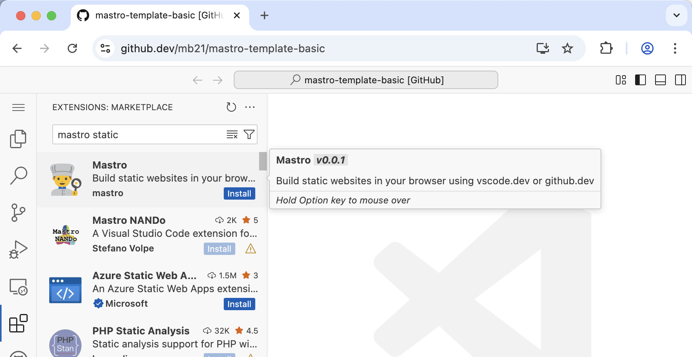

The Mastro _Visual Studio Code for the Web_ extension lets you run the
Mastro static site generator (SSG) right in your browser.

No need to install anything or mess around with the command line. Never wait for a slow deployment pipeline again: you'll know immediately if the generation failed for whatever reason.

Since all the processing happens upfront, and the generated files are served from a CDN close to your users, a static site is extremely fast and secure.
We'll be using GitHub Pages, which hosts your static site for free.

## Create a new _GitHub_ repository

If you want, you can buy and [configure a custom domain](https://docs.github.com/en/pages/configuring-a-custom-domain-for-your-github-pages-site) later. But by default, GitHub Pages will publish your website for free under:

    https://your-user-name.github.io/your-repository-name/

1. [Create a free GitHub account](https://github.com/signup). Choose your username wisely, because it will show up in lots of places. Ideally, something relatively short that's still available.

2. [Create a new repository](https://github.com/new). A repository is where you will store your project's files. The only field you need to change is the _Repository name_: call it something short and descriptive like `blog`, or `cooking-website`, or even the domain name of your future website (like `cooking.com`) if you have reserved one already. Then click _Create repository_.

## Open _Visual Studio Code for the Web_

Now that you're on your repository's page on GitHub:

1. press the `.` key on your computer's keyboard to open the _Visual Studio Code for the Web_ editor. Alternatively, you can go to `https://github.dev/your-user-name/your-repository-name/` (this is the same address you're already on, but instead of `github.com`, it uses `github.dev`).
2. When prompted about signing in using GitHub, click the _Allow_ button.
3. To select your GitHub user, press `enter` in the small dialog that opens.

## Install the _Mastro_ extension

Install the following two VS Code extensions. In the _Activity Bar_ on the left, click the _Extensions_ icon (four blocks, with one flying away).

- Install [Mastro](https://marketplace.visualstudio.com/items?itemName=mastro.mastro-vscode-extension) by searching for `mastro` (it should be the first search result, the one with the picture of a cook) and click _Install_. Click _Trust Publisher & Install_ when prompted.
- Install [FAST Tagged Template Literals](https://marketplace.visualstudio.com/items?itemName=ms-fast.fast-tagged-templates) by searching for `fast-tagged-templates`.

Done? Congrats, you're all set up now! You can switch back to the _Explorer_ view (the topmost icon in the activity bar on the left) to finally write some HTML.
