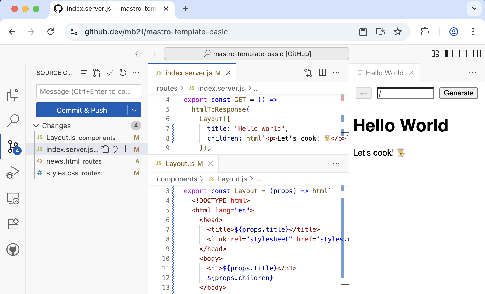

import { LinkButton } from '@astrojs/starlight/components';

> A woodworker cares about wood – no cheap plastics.\
> A cook cares about plants and meat – no fast food.\
> A "webmastro" cares about HTML and CSS – no bloat.

Most of today’s websites are drowning in a sea of banners and JavaScript.
Instead of looking after their users, developers are busy
fighting complex tooling like bundlers, and
are stuck on a treadmill of ever changing dependencies.
Mastro is here to show a different path.

<LinkButton href="/guide/">Follow the guide</LinkButton>
<LinkButton href="https://github.dev/mastrojs/template-basic" variant="secondary" class="hide-on-mobile">
  Try on github.dev
</LinkButton>

<p style="margin-top: 3em"></p>


## The Guide

Introductory guide to HTML, CSS and JavaScript.
Learn how to handcraft a website and publish it to GitHub Pages for free – all from within your browser.

<LinkButton href="/guide/">Build and publish your first website</LinkButton>


## Static site generator in your browser

The Mastro _Visual Studio Code for the Web_ extension generates a website right in your browser.

<LinkButton href="https://github.dev/mastrojs/template-basic">Try on github.dev</LinkButton>
<LinkButton href="/guide/setup/" variant="secondary">Learn more</LinkButton>


## Web framework that grows with you

Mastro is a *m*inimal *Astro*-like framework and static site generator built from first principles.

- **No bloat**: written in just [~700 lines](https://github.com/mastrojs/mastro/tree/main/src#readme) of TypeScript,
  Mastro is a web framework distilled to its essence. If you ever outgrow it, you can simply fork and adjust it.
- **No bundler** and full control over your HTML, CSS and JS. Mastro gives you composable functions
and no complex tooling messing with your code before it reaches the browser.
- **No client-side JavaScript** by default: create lean websites, that load blazingly fast.

Give it a try! To start a new project, [install Deno](https://docs.deno.com/runtime/getting_started/installation/)
and either use the [template repo](https://github.com/mastrojs/template-basic-deno) or run:

```
deno run -A jsr:@mastrojs/mastro@0.0.9/init
```

<LinkButton href="https://github.com/mastrojs/mastro/" variant="secondary">Star Mastro on GitHub</LinkButton>
<LinkButton href="/guide/multiple-pages-with-shared-components/" variant="secondary">Follow the Guide</LinkButton>
<LinkButton href="https://jsr.io/@mastrojs/mastro/doc" variant="minimal">API docs</LinkButton>
<LinkButton href="https://github.com/mastrojs/mastro/tree/main/src#readme" variant="minimal">Explore the source</LinkButton>


## Reactive Mastro – interactivity simplified

A tiny (2.8k min.gz) client-side reactive GUI library for your existing MPA or Mastro project.

<LinkButton href="/reactive/">Build interactive user interfaces</LinkButton>
<LinkButton href="/reactive/why-reactive-mastro/" variant="secondary">Why Reactive Mastro?</LinkButton>


## Community

Something not working as expected? Would you like to contribute?
Please open a [GitHub issue](https://github.com/mastrojs/mastro/issues/).

<style>h1 \{ text-align: center; \}</style>
